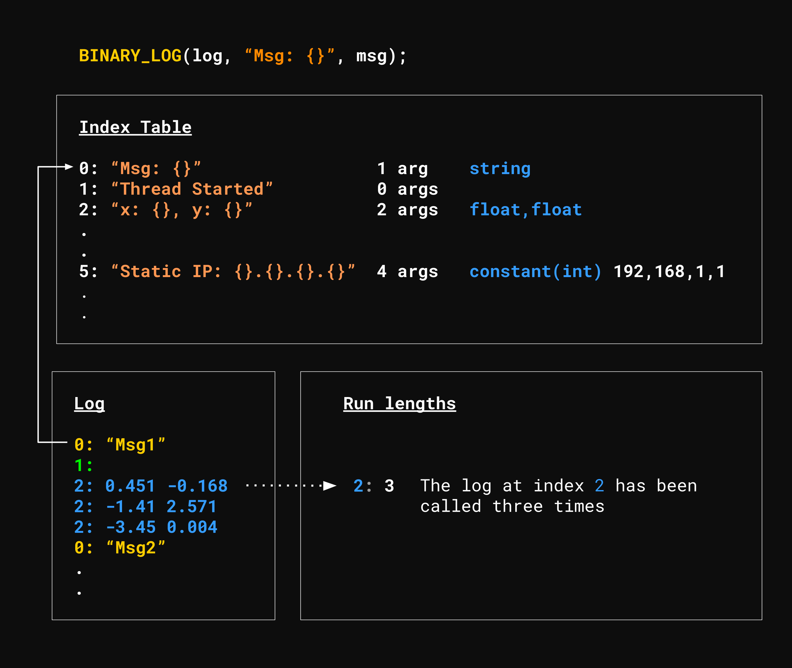

<p align="center">
    
</p>

# Highlights

* Logs messages in a compact binary format
* Fast
  * ***Hundreds of millions*** of logs per second
  * Average latency of ***1-3 ns*** for basic data types
  * See [benchmarks](https://github.com/p-ranav/binary_log#benchmarks)
* Provides an [unpacker](https://github.com/p-ranav/binary_log/tree/master/tools/unpacker) to deflate the log messages
* Uses [fmtlib](https://github.com/fmtlib/fmt) to format the logs
* Synchronous logging - not thread safe
* Header-only library
  - Single header file version available [here](https://github.com/p-ranav/binary_log/blob/master/single_include/binary_log/binary_log.hpp)
* Requires C++20
* MIT License

# Usage and Performance

The following code logs 1 billion integers to file.

```cpp
#include <binary_log/binary_log.hpp>

int main()
{
  binary_log::binary_log log("log.out");

  for (int i = 0; i < 1E9; ++i)
    BINARY_LOG(log, "Hello logger, msg number: {}", i);
}
```

On a [modern workstation desktop](#system-details), the above code executes in `~2s`.

| Type            | Value               |
| --------------- | --------------------|
| Time Taken      | 1.935 s             | 
| Throughput      | 2.06 Gb/s           |
| Performance     | 516 million logs/s  |
| Average Latency | ~2 ns               |
| File Size       | ~4 GB               |

```console
foo@bar:~/dev/binary_log$ time ./build/examples/billion_integers/billion_integers

real    0m1.935s
user    0m0.906s
sys     0m1.000s

foo@bar:~/dev/binary_log$ ls -lart log.out*
-rw-r--r-- 1 pranav pranav         10 Sep 20 11:46 log.out.runlength
-rw-r--r-- 1 pranav pranav         33 Sep 20 11:46 log.out.index
-rw-r--r-- 1 pranav pranav 4000000002 Sep 20 11:46 log.out
```

## Deflate the logs

These binary log files can be deflated using the provided [unpacker](https://github.com/p-ranav/binary_log/tree/master/tools/unpacker) app:

```console
foo@bar:~/dev/binary_log$ time ./build/tools/unpacker/unpacker log.out > log.deflated

real    2m19.853s
user    1m16.078s
sys     0m50.969s

foo@bar:~/dev/binary_log$ ls -lart log.deflated
-rw-r--r-- 1 pranav pranav 35888888890 Dec  6 08:09 log.deflated

foo@bar:~/dev/binary_log$ wc -l log.deflated
1000000000 log.deflated

foo@bar:~/dev/binary_log$ $ head log.deflated
Hello logger, msg number: 0
Hello logger, msg number: 1
Hello logger, msg number: 2
Hello logger, msg number: 3
Hello logger, msg number: 4
Hello logger, msg number: 5
Hello logger, msg number: 6
Hello logger, msg number: 7
Hello logger, msg number: 8
Hello logger, msg number: 9

foo@bar:~/dev/binary_log$ tail log.deflated
Hello logger, msg number: 999999990
Hello logger, msg number: 999999991
Hello logger, msg number: 999999992
Hello logger, msg number: 999999993
Hello logger, msg number: 999999994
Hello logger, msg number: 999999995
Hello logger, msg number: 999999996
Hello logger, msg number: 999999997
Hello logger, msg number: 999999998
Hello logger, msg number: 999999999
```

| Type                | Value      |
| ------------------- | ---------- |
| Time Taken          | 2m 19s     | 
| Throughput          | 258 MB/s   |
| Original File Size  | ~5 GB      |
| Deflated File Size  | ~35 GB     |
| Log Compression     | ***7x***   |

See [benchmarks](https://github.com/p-ranav/binary_log/blob/master/README.md#benchmarks) section for more performance metrics.

# Design Goals & Decisions

* Implement a single-threaded, synchronous logger - Do not provide thread safety
  - If the user wants multi-threaded behavior, the user can choose and implement their own queueing solution
  - There are numerous well-known lock-free queues available for this purpose ([moody::concurrentqueue](https://github.com/cameron314/concurrentqueue), [atomic_queue](https://github.com/max0x7ba/atomic_queue) etc.) - let the user choose the technology they want to use.
  - The latency of enqueuing into a lock-free queue is large enough to matter
    - Users who do not care about multi-threaded scenarios should not suffer the cost
    - Looking at the [atomic_queue benchmarks](https://max0x7ba.github.io/atomic_queue/html/benchmarks.html), the average round-trip latency across many state-of-the-art multi-producer, multi-consumer queues, to send and receive a 4-byte integer (between 2 threads, using 2 queues) is around 150-250 ns.
* Avoid writing static information more than once
  - Examples of static information: the format string, the number of format args, and type of each format arg
  - Store the static information in an "index" file 
  - Store the dynamic information in the log file (refer to the index file where possible)
* Do as little work as possible in the runtime hot path
  - No formatting of any kind
  - All formatting will happen offline using an unpacker that deflates the binary logs

# How it Works

`binary_log` splits the logging into three files:

<p>
    
</p>

1. ***Index file*** contains all the static information from the logs, e.g., format string, number of args, type of each arg etc.
   - If a format argument is marked as constant using `binary_log::constant`, the value of the arg is also stored in the index file
2. ***Log file*** contains two pieces of information per log call:
   1. An index into the index table (in the index file) to know which format string was used
      - If runlength encoding is working, this index might not be written, instead the final runlength will be written to the runlengths file
   3. The value of each argument
3. ***Runlength file*** contains runlengths - If a log call is made 5 times, this information is stored here (instead of storing the index 5 times in the log file)
   - NOTE: Runlengths are only stored if the runlength > 1 (to avoid the inflation case with RLE)

## Constants

One can specify a log format argument as a constant by wrapping the value with `binary_log::constant(...)`. When this is detected, the value is stored in the index file instead of the log file as it is now considered "static information" and does not change between calls. 

```cpp
for (auto i = 0; i < 1E9; ++i) {
  BINARY_LOG(log, "Joystick {}: x_min={}, x_max={}, y_min={}, y_max={}",
             binary_log::constant("Nintendo Joycon"),
             binary_log::constant(-0.6),
             binary_log::constant(+0.65),
             binary_log::constant(-0.54),
             binary_log::constant(+0.71));
}
```

The above loop runs in under `500 ms`. The final output is compact at just `118 bytes` and contains all the information needed to deflate the log (if needed). 

| File               | Size      |
| ------------------ | --------- |
| log.out            | 1 byte    | 
| log.out.runlength  | 6 bytes   |
| log.out.index      | 111 bytes |

```console
foo@bar:~/dev/binary_log$ ls -lart log.out*
-rw-r--r-- 1 pranav pranav   6 Dec  5 08:41 log.out.runlength
-rw-r--r-- 1 pranav pranav 111 Dec  5 08:41 log.out.index
-rw-r--r-- 1 pranav pranav   1 Dec  5 08:41 log.out

foo@bar:~/dev/binary_log$ hexdump -C log.out.index
00000000  33 4a 6f 79 73 74 69 63  6b 20 7b 7d 3a 20 78 5f  |3Joystick {}: x_|
00000010  6d 69 6e 3d 7b 7d 2c 20  78 5f 6d 61 78 3d 7b 7d  |min={}, x_max={}|
00000020  2c 20 79 5f 6d 69 6e 3d  7b 7d 2c 20 79 5f 6d 61  |, y_min={}, y_ma|
00000030  78 3d 7b 7d 05 0c 0b 0b  0b 0b 01 0f 4e 69 6e 74  |x={}........Nint|
00000040  65 6e 64 6f 20 4a 6f 79  63 6f 6e 01 33 33 33 33  |endo Joycon.3333|
00000050  33 33 e3 bf 01 cd cc cc  cc cc cc e4 3f 01 48 e1  |33..........?.H.|
00000060  7a 14 ae 47 e1 bf 01 b8  1e 85 eb 51 b8 e6 3f     |z..G.......Q..?|
0000006f
```

# Benchmarks

### System Details

| Type            | Value                                                                                                     |
| --------------- | --------------------------------------------------------------------------------------------------------- |
| Processor       | 11th Gen Intel(R) Core(TM) i9-11900KF @ 3.50GHz   3.50 GHz                                                |
| Installed RAM   | 32.0 GB (31.9 GB usable)                                                                                  |
| SSD             | [ADATA SX8200PNP](https://www.adata.com/upload/downloadfile/Datasheet_XPG%20SX8200%20Pro_EN_20181017.pdf) |
| OS              | Ubuntu 20.04 LTS running on WSL in Windows 11                                                             |
| C++ Compiler    | g++ (Ubuntu 10.3.0-1ubuntu1~20.04) 10.3.0                                                                 |

```console
foo@bar:~/dev/binary_log$ ./build/benchmark/binary_log_benchmark
2022-09-20T10:13:53-05:00
Running ./build/benchmark/binary_log_benchmark
Run on (16 X 3504 MHz CPU s)
Load Average: 0.52, 0.58, 0.59
------------------------------------------------------------------------------------------------------------------
Benchmark                                                        Time             CPU   Iterations UserCounters...
------------------------------------------------------------------------------------------------------------------
BM_binary_log_static_integer<uint8_t>/42                      1.38 ns         1.28 ns    560000000 Latency=1.28348ns Logs/s=779.13M/s
BM_binary_log_static_integer<uint16_t>/395                    1.50 ns         1.50 ns    448000000 Latency=1.49972ns Logs/s=666.791M/s
BM_binary_log_static_integer<uint32_t>/3123456789             1.92 ns         1.88 ns    373333333 Latency=1.88337ns Logs/s=530.963M/s
BM_binary_log_static_integer<uint64_t>/9876543123456789       4.43 ns         2.89 ns    248888889 Latency=2.88783ns Logs/s=346.28M/s
BM_binary_log_static_integer<int8_t>/-42                      1.31 ns         1.28 ns    560000000 Latency=1.28348ns Logs/s=779.13M/s
BM_binary_log_static_integer<int16_t>/-395                    1.48 ns         1.48 ns    497777778 Latency=1.47531ns Logs/s=677.825M/s
BM_binary_log_static_integer<int32_t>/-123456789              1.90 ns         1.90 ns    344615385 Latency=1.9043ns Logs/s=525.128M/s
BM_binary_log_static_integer<int64_t>/-9876543123456789       3.31 ns         2.79 ns    263529412 Latency=2.78669ns Logs/s=358.849M/s
BM_binary_log_static_float                                    2.72 ns         1.67 ns    448000000 Latency=1.67411ns Logs/s=597.333M/s
BM_binary_log_static_double                                   4.17 ns         2.51 ns    280000000 Latency=2.51116ns Logs/s=398.222M/s
BM_binary_log_static_string                                   2.85 ns         2.83 ns    248888889 Latency=2.82506ns Logs/s=353.975M/s
BM_binary_log_random_integer<uint8_t>                         5.79 ns         5.86 ns    112000000 Latency=5.85938ns Logs/s=170.667M/s
BM_binary_log_random_integer<uint16_t>                        5.99 ns         6.00 ns    112000000 Latency=5.99888ns Logs/s=166.698M/s
BM_binary_log_random_integer<uint32_t>                        7.94 ns         8.02 ns     89600000 Latency=8.02176ns Logs/s=124.661M/s
BM_binary_log_random_integer<uint64_t>                        15.0 ns         15.1 ns     49777778 Latency=15.067ns Logs/s=66.3704M/s
BM_binary_log_random_integer<int8_t>                          5.75 ns         5.72 ns    112000000 Latency=5.71987ns Logs/s=174.829M/s
BM_binary_log_random_integer<int16_t>                         5.94 ns         5.86 ns    112000000 Latency=5.85938ns Logs/s=170.667M/s
BM_binary_log_random_integer<int32_t>                         8.12 ns         8.16 ns     74666667 Latency=8.16127ns Logs/s=122.53M/s
BM_binary_log_random_integer<int64_t>                         15.2 ns         15.1 ns     49777778 Latency=15.067ns Logs/s=66.3704M/s
BM_binary_log_random_real<float>                              6.48 ns         6.56 ns    112000000 Latency=6.55692ns Logs/s=152.511M/s
BM_binary_log_random_real<double>                             11.8 ns         11.7 ns     64000000 Latency=11.7188ns Logs/s=85.3333M/s
```

# Implementation Notes

## Assumptions in the code

* The size of the format string is saved as a `uint8_t` - this means that the format string cannot be more than 256 characters, which I think is a reasonable assumption to make for a logging library. Often, in reality, the lines of a log file are around 80-120 characters in length. 
* The size of any string argument is also stored as a `uint8_t` - this again means that any string argument must be no more than 256 bytes in size.
  - In both the index file and the log file, strings are stored like this: `<string-length (1 byte)> <string-byte1> ... <string-byten>`
* The index file contains a table of metadata - an index table. Each entry in the log file might use an index to refer to row in the index table (I say _might_ because if there is a runlength > 1, the index will be stored in the runlength file). The type of this index is `uint8_t`. This data type choice has one major implication: The max size of the index table is 256 (since the max index is 255) - this means that a user can call `BINARY_LOG(...)` in at most 256 unique lines of code with a specific `binary_log` object. This should be sufficient for small to medium size applications but may not be adequate for larger applications where one logger is used with `BINARY_LOG(...)` through out the application in more than 256 places.
  - One could expose this data type as a template parameter but the unpacker will need to be updated to correctly parse, e.g., a `uint16_t` for the index instead of a `uint8_t`
  - Note that switching to `uint16_t` here means that every log call will store an extra byte to be able to refer to an entry in the index table - an extra byte per call _could_ be an extra 1GB over billion log calls. 
* The [unit tests](https://github.com/p-ranav/binary_log/blob/master/test/source/test_packer.cpp) assume little endian representation for multi-byte data, e.g., int, float etc.

## Supported Format Argument Types

`binary_log` supports a limited number of types of format arguments. They are:

```
bool,
char, 
uint8_t, uint16_t, uint32_t, uint64_t
int8_t, int16_t, int32_t, int64_t,
float, double,
const char*,
std::string,
std::string_view
```

# Building and installing

See the [BUILDING](BUILDING.md) document.

## Generating Single Header

```bash
python3 utils/amalgamate/amalgamate.py -c single_include.json -s .
```

# Contributing

See the [CONTRIBUTING](CONTRIBUTING.md) document.

# License

The project is available under the [MIT](https://opensource.org/licenses/MIT) license.
